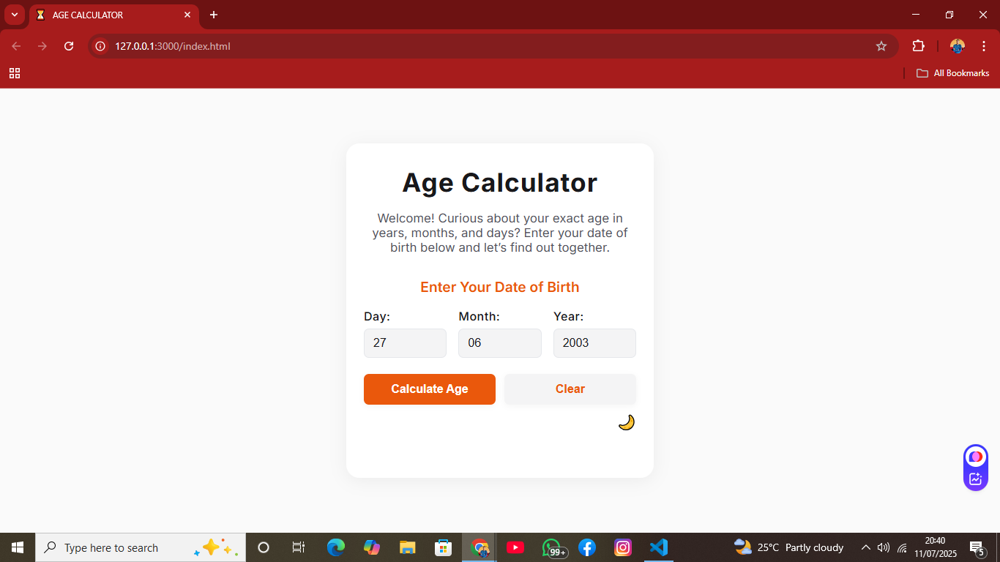
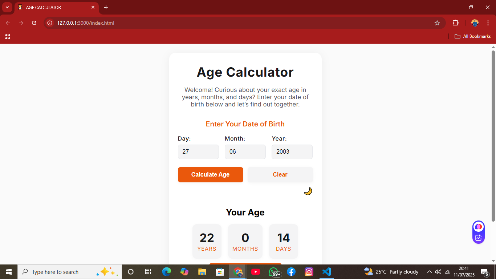
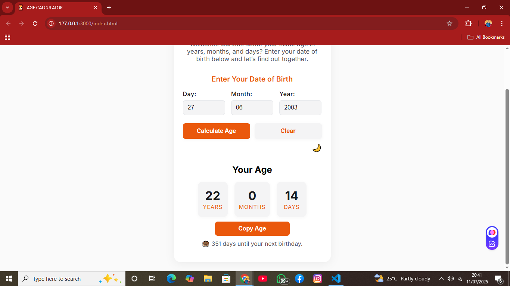
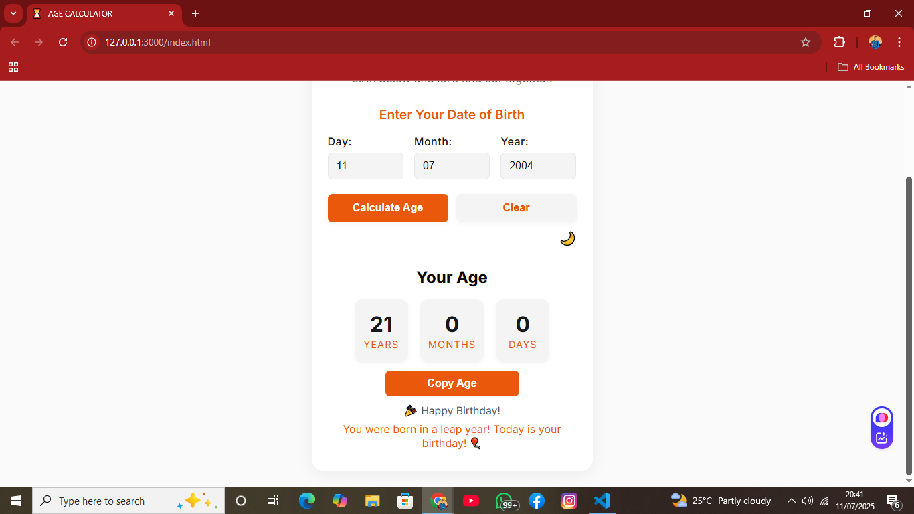

# Age Calculator

A simple web-based age calculator built with HTML, CSS, and JavaScript.

## Objective

Enter your date of birth (day, month, year) and see your exact age in years, months, and days.

## Features

- User inputs Date of Birth (day, month, year)
- Calculates and displays age in years, months, and days
- Input validation for correct date entry
- Countdown to your next birthday
- Special messages for leap years and birthdays
- Dark mode toggle
- Copy age result to clipboard
- Remembers your last entered date (localStorage)
- Responsive and accessible design

## Tech Stack

- HTML (input form)
- CSS (styling)
- JavaScript (age calculation using Date object)

## Usage

1. Download or clone this repository.
2. Open `index.html` in your browser.
3. Enter your date of birth and click "Calculate Age".
4. View your age, copy or toggle dark mode.

## Screenshots

---

Made by Kolawole Joshua for the CodeAlpha Web Development Internship.