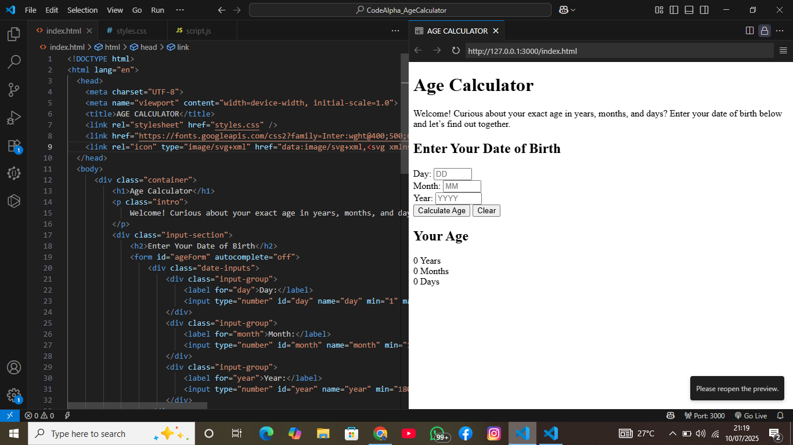
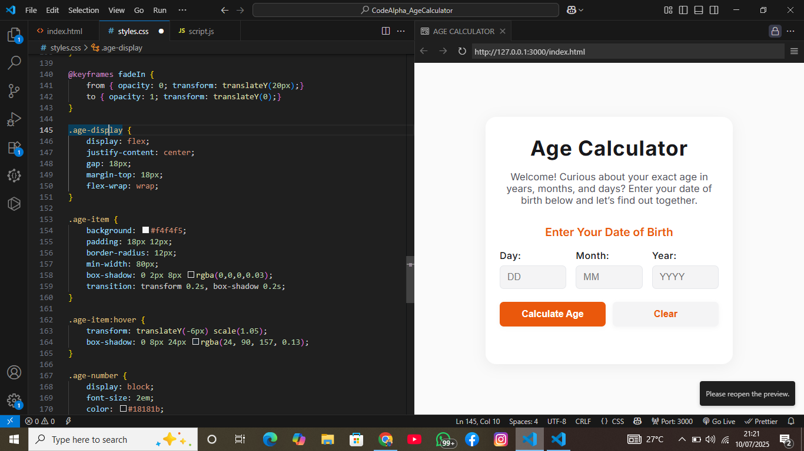
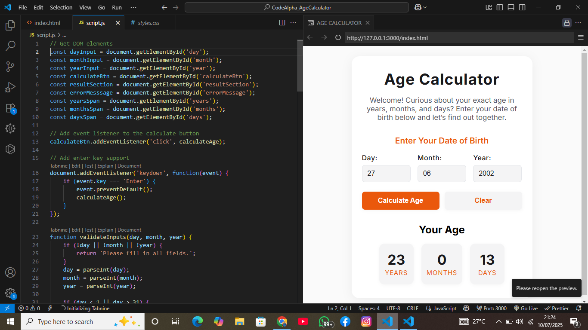
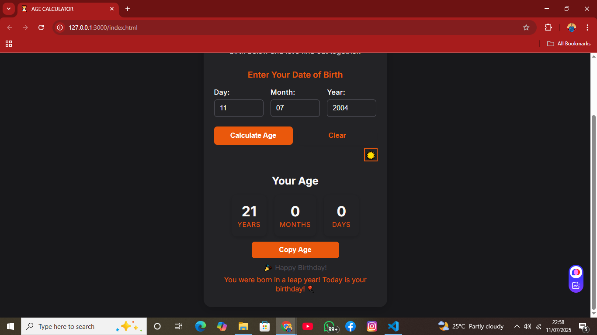

#  CodeAlpha Age Calculator

 *Hosting in progres*   |    [View Source Code](https://github.com/kingkreation/CodeAlpha_AgeCalculator.git)

---

##  Overview

This is a simple yet robust Age Calculator web app built during the CodeAlpha Web Development Internship. It takes a user's date of birth and calculates their age in years, months, and days — with added features like birthday countdown, dark mode toggle, and input memory.

---

##  Tech Stack

-  HTML — structure and input form  
-  CSS — responsive styling and layout  
-  JavaScript — age logic, validation, dynamic UI  
-  Bonus: Manual Testing practices from TestarsQuarter QA Bootcamp  

---

##  Screenshots

> Screenshots saved in [`/images/screenshots/`](/images/screenshots/) directory:

 

---

##  Features

-  Accepts valid birthdates  
-  Calculates accurate age (years, months, days)  
-  Handles edge cases (e.g., leap years, future dates)  
-  Dark mode toggle  
-  Copy age result to clipboard  
-  Saves last input using localStorage  
-  Countdown to next birthday  
-  Fully tested using manual QA test cases (see `TESTING.md`)  

---

##  Testing

> Testing inspired by real-life manual testing skills acquired from the TestarsQuarter Bootcamp

To view test cases, scenarios, and evidence:  
📁 [`TESTING.md`](./TESTING.md)

---

## 👨🏽‍💻 Author

**Joshua Kolawole** (CA/JU3/3835)  
- BSc Physics
- Web Development Intern @ CodeAlpha  
- QA Trainee @ TestarsQuarter  
🌐 [LinkedIn](https://www.linkedin.com/in/joshua-kolawole-40062a287) | ✉️ [Email](mailto:kolawolejoshua459@gmail.com)

---

## 🏁 Project Status

- Completed & submitted as Task 1 for CodeAlpha Internship  
- Ready for future improvements like hosting and adding animations

---